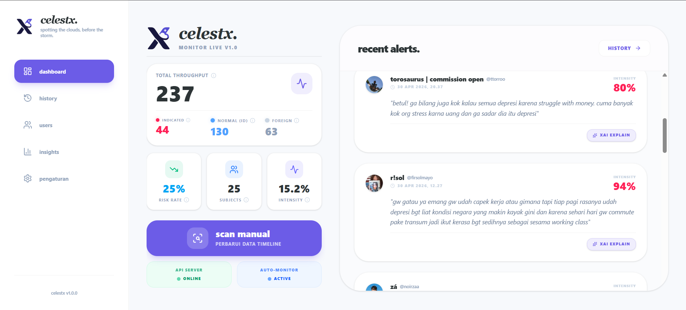
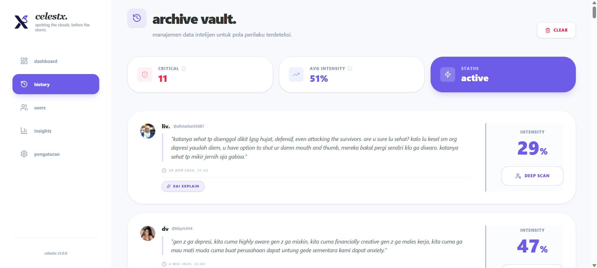
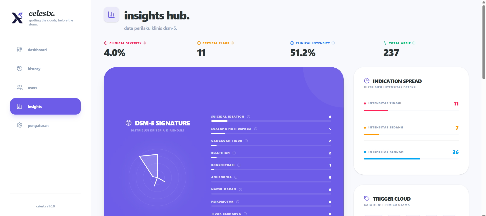
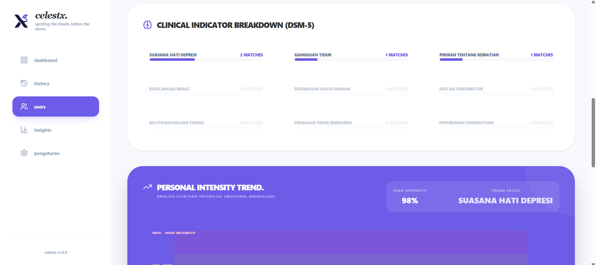
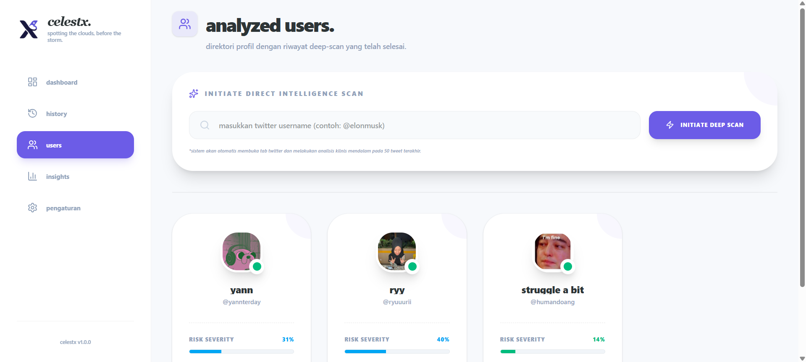
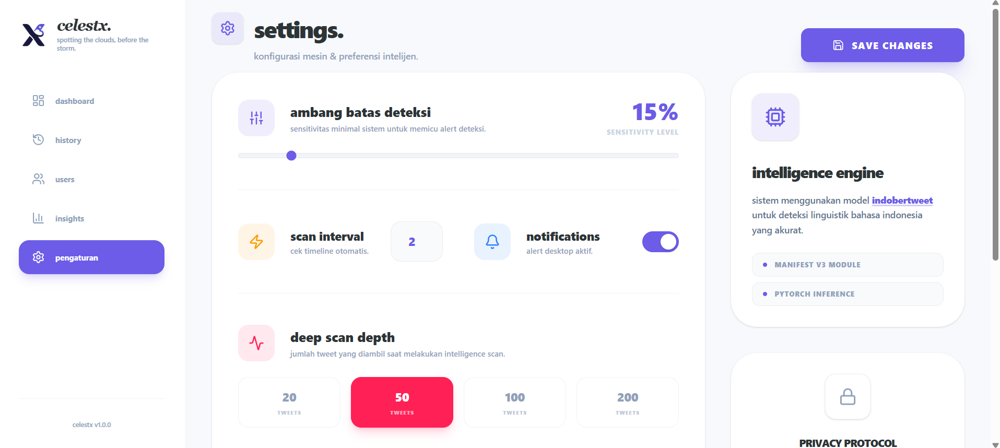
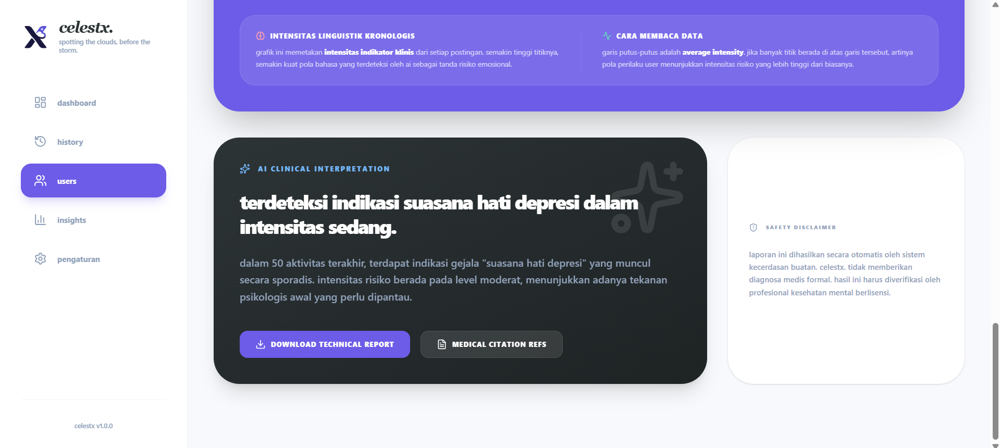

# celestx.
> **spotting the clouds, before the storm.**

celestx. is a high-performance analytical suite specifically engineered to identify risky behavioral patterns in **bahasa indonesia**. built on the **fine-tuned indobertweet** transformer model, it provides state-of-the-art nlp accuracy for indonesian social media context, mapping raw data to **dsm-5** clinical standards.

<div align="center">
  
</div>

## philosophy & vision
derived from the latin *caelestis* (**celeste**) meaning **"sky"**, this platform acts as a digital observatory for the human mind. 

in mental health, depression is often visualized as a gathering of dark clouds that obscure one's internal sky. **celestx**—a fusion of this metaphor and the **x** (twitter) platform—is designed to detect ini these subtle "linguistic clouds" in real-time. by identifying early indicators, we aim to provide clarity and a chance for intervention before the emotional storm hits.

## project structure

```text
celestx/
├── backend/                # python fastapi server
│   ├── main.py             # api entry point & routing
│   ├── model_ta/           # fine-tuned indobertweet model weights
│   └── requirements.txt    # backend dependencies
├── dashboard/              # react (vite) frontend & extension
│   ├── src/                # react source code
│   │   ├── pages/          # dashboard, history, analysis pages
│   │   ├── components/     # reusable ui components
│   │   └── constants/      # clinical lexicon (dsm-5)
│   ├── manifest.json       # chrome extension manifest v3
│   └── background.js       # extension background logic
└── img/                    # documentation assets (screenshots)
```

## core features

### command center (dashboard)
*   **live monitor**: real-time tracking of indonesian twitter/x timelines with instant risk flagging.
*   **hybrid scoring**: advanced risk assessment using a balanced mean of global activity and peak intensity (top-10).


### archive vault (history)
*   **intelligence database**: a secured record of all identified risks, organized by confidence and timestamp.
*   **drill-down analysis**: click on any clinical category to view specific tweet evidence in a dedicated modal.



### insights hub (clinical analytics)
*   **dsm-5 mapping**: dynamic keyword matching validated by ai for 9 clinical categories.
*   **personal intensity trend**: chronological visualization of emotional fluctuation with severity zones.



## intelligence gallery

<table border="0">
  <tr>
    <td width="50%">
      
      <p align="center"><b>clinical symptom mapping</b></p>
    </td>
    <td width="50%">
      
      <p align="center"><b>monitored profiles</b></p>
    </td>
  </tr>
  <tr>
    <td width="50%">
      
      <p align="center"><b>engine configuration</b></p>
    </td>
    <td width="50%">
      
      <p align="center"><b>deep behavioral analytics</b></p>
    </td>
  </tr>
</table>

## technology stack
*   **primary classifier**: **fine-tuned indobertweet** (optimized for indonesian social media linguistic nuances).
*   **semantic engine**: **indo-sbert** (used for high-precision dsm-5 symptom mapping via cosine similarity).
*   **backend**: fastapi (python) + pytorch
*   **frontend**: react.js + tailwind css + lucide icons + framer motion
*   **integration**: chrome extension manifest v3

## clinical methodology (dsm-5)
the platform utilizes a **dual-layer validation** strategy to ensure high diagnostic sensitivity:

*   **layer 1 (gatekeeper)**: **indobertweet** 
    *   acts as the primary classifier to filter whether a tweet contains depressive indicators or is simply normal speech.
*   **layer 2 (diagnostic)**: **indo-sbert** 
    *   performs semantic similarity analysis (*cosine similarity*) to map the identified tweet into one of the 9 dsm-5 clinical categories:
        1. suasana hati depresi
        2. anhedonia (hilang minat)
        3. perubahan nafsu makan
        4. gangguan tidur
        5. agitasi psikomotor
        6. keletihan (hilang energi)
        7. perasaan tidak berharga
        8. penurunan konsentrasi
        9. pikiran tentang kematian

---

## getting started

### 1. backend setup
```bash
cd backend
# create virtual environment (recommended)
python -m venv venv
source venv/bin/activate # or venv\Scripts\activate on windows

# install dependencies
pip install -r requirements.txt

# run the server
python main.py
```
*server will be available at `http://localhost:8000`*

### 2. frontend setup
```bash
cd dashboard
npm install
npm run dev
```
*dashboard will be available at `http://localhost:5173`*

### 3. chrome extension installation
1.  run `npm run build` in the `dashboard` folder.
2.  open chrome and go to `chrome://extensions/`.
3.  enable **developer mode**.
4.  click **load unpacked** and select the `dashboard/dist` folder.

---

## clinical disclaimer
this platform is developed for **academic and research purposes only**. it is designed as a preliminary screening tool and **does not provide medical diagnosis**. the analysis results should not be used as a substitute for professional psychological or psychiatric advice, diagnosis, or treatment. users are encouraged to seek professional help from licensed mental health practitioners for any clinical concerns.

## api reference
the backend provides a stateless restful api for real-time inference:

| endpoint | method | description |
| :--- | :--- | :--- |
| `/predict` | `POST` | analyzes a single text input for depression indicators. |
| `/predict-user` | `POST` | batch processing for multiple tweets with semantic symptom mapping. |
| `/explain` | `POST` | generates shap-based local explanations for a specific prediction. |
| `/health` | `GET` | returns system and model status. |

---

<div align="center">

**celestx.** was built with deep empathy for mental health awareness.
  
*developed for advanced behavioral research and clinical early-intervention in the indonesian social media landscape.*

</div>